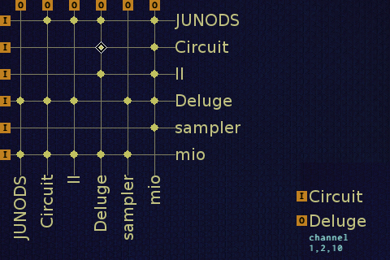

# midibus
My implementation of a MIDI bus to connect multiple synths

## Legacy implementation

Uses `udev` rules to make ALSA sequencer connections when plugged in, updates the UI when changes are made.

## Latest incarnation

Still uses `udev` rules, but uses the ALSA RawMidi Interface to listen for
incoming messages and relay them to output devices in a threaded server which
handles SIGHUP when a new device is connected.

### But why?

- I want to get as close to parsing actual MIDI messages as possible
without all the extra metadata attached to each event by ALSA.
- This way I can implement my own filtering and custom macros.
  - Relay realtime messages from the Deluge, send all realtime messages from the
Electribe to `/dev/null`.
  - Gracefully handle forwarding system exclusive messages so I can program my
JUNO from the computer.

## What does my setup look like?

The concept of a "main keyboard" has stuck with me, and for this purpose I
currently use the Roland JUNO-DS 88. Connected to my Raspberry Pi running this
software, I have a Synthstrom Audible Deluge for
sequencing and sound design, a Moog Little Phatty Stage II for warm analog synth
sounds, a Novation Circuit for synth layering, a Korg Electribe Sampler for
effects and drum layering, and finally an iConnectivity mio that acts as a
bridge between my synth rig and my DAW computer.

## Screenshot

## Client/server

Currently the client is pretty simple; it loads configuration via socket stream.
It will change in the future to be more interactive. But hey, at least it
looks good, and you can see the current configuration presented visually.

The server has a thread for each input device, and maintains state for each
output device in shared memory.

